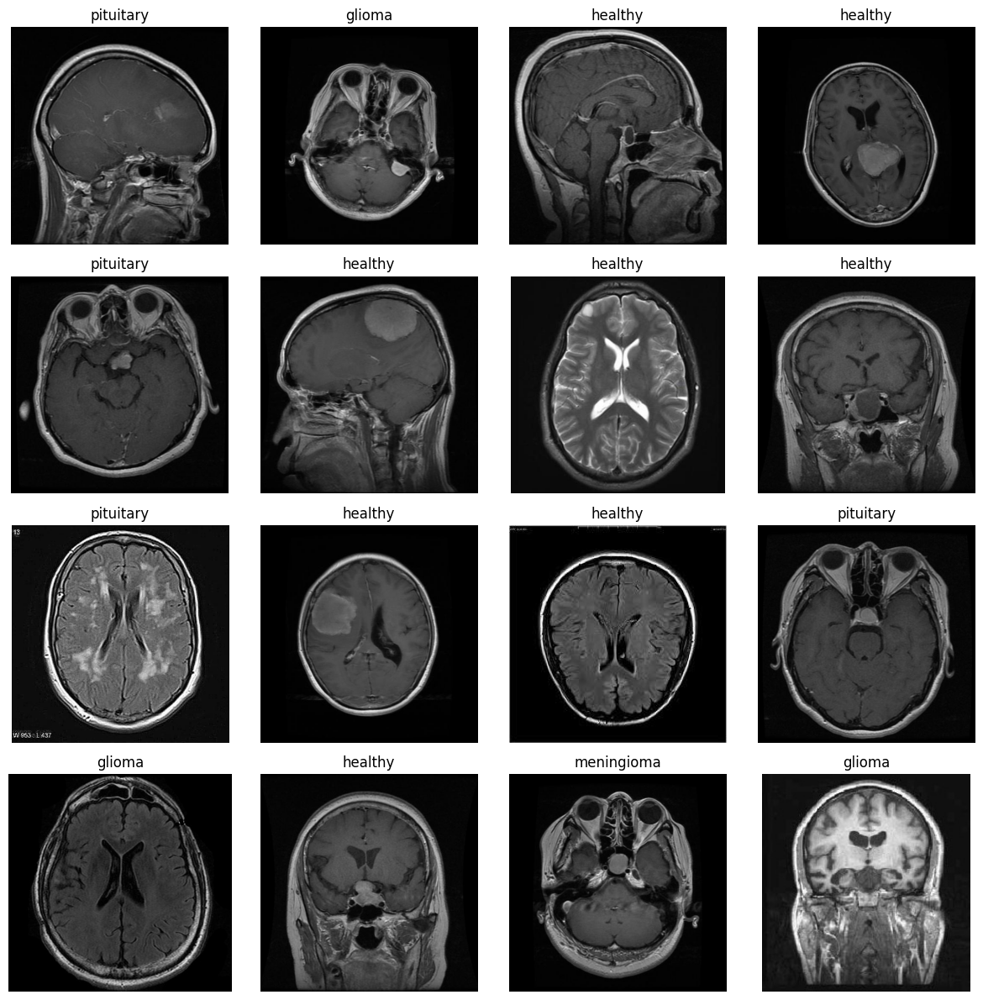
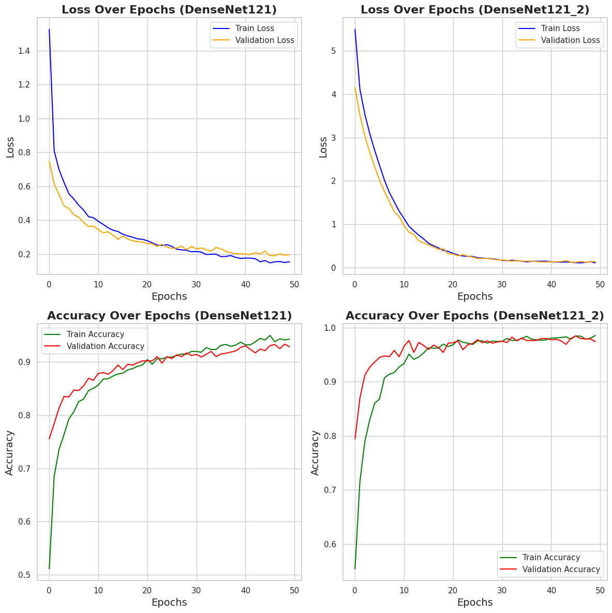
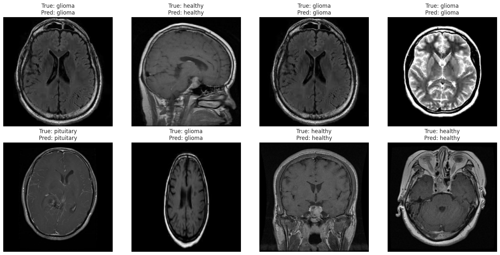

# About Dataset 
There a total of 7023 MRI scans of brains split into four classes. Transfer learning and CNNs could be used for classifying these images, which could save patient lives through early tumor diagnosis.

Data source: https://www.kaggle.com/datasets/rm1000/brain-tumor-mri-scans/data

# The dataset consists of brain tumor MRI scans, which were used for a multi-class classification task. The data was loaded and processed into appropriate formats using `tf.keras.preprocessing.image_dataset_from_directory`, ensuring that images were resized to 224x224 and batched efficiently.

 

# Method

This model is built using DenseNet121, a pre-trained convolutional neural network (CNN), adapted for a custom image classification task. The model takes 224x224 RGB images as input and uses pre-trained weights from a custom directory (I download and uploaded on Kaggle). Two versions of DenseNet121 were implemented. To ensure better understanding and transparency in the model's behavior, two key evaluation techniques were implemented:

 

# output

By utilizing DenseNet121 and carefully fine-tuning its layers, the model was able to effectively classify brain tumor MRI scans with high accuracy. 

 

# Contact

For any issues or questions, feel free to send an email to abdullahiadinoyi857@gmail.com.